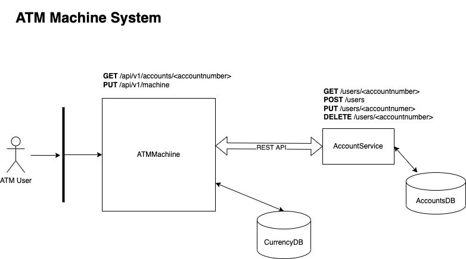

# zinkworks-atm-machine
This is a sample ATM machine microservices. This is to show how microservices interact with each other to give best AM experience.

## Architecture
The ATM System contains two microservices as shown in the diagram:

1. ATM Service (atm-service): This contains the below APIs:
   /atm/balance: Check the balance in the ATM
   /withdraw: The users can withdraw money from the ATM based on the balance in the account
   /deposit: This is for the admins to deposit money in the ATM
2. Account Service (account-service): This is to validate the accounts of the users. The below are the APIs:
   /balance: Check the balance in the account
   /withdraw/{amount}: Withdraw money from the account and return balances.
   

## How to use
### Start the services
The solution is available as docker. Start the docker containers using the below commands:

Note: This requires docker and docker-compose installed on the host.
i) Refer to https://docs.docker.com/get-docker/ to install docker
ii) Refer to https://docs.docker.com/compose/install/ to install docker-compose.

1. Clone the repo:  https://github.com/shivasr/zinkworks-atm-machine.git
```shell
 git clone  https://github.com/shivasr/zinkworks-atm-machine.git
 cd zinkworks-atm-machine
```
2. Start the docker containers
```shell
 docker-compose up --build
```

### Hit the REST APIs
1. Check the balance in the atm
```shell
curl --location --request GET 'http://localhost:3000/api/v1/atm/balance' \
--header 'Accept: application/json'
```
Sample Output
```shell
[
    {
        "currency": 50,
        "number": 10
    },
    {
        "currency": 20,
        "number": 30
    },
    {
        "currency": 10,
        "number": 30
    },
    {
        "currency": 5,
        "number": 20
    }
]
```

2. Check the balance in the users account: 123456789
```shell
curl --location --request POST 'http://localhost:3000/api/v1/balance' \
--header 'Content-Type: application/json' \
--data-raw '{
"accountNumber": "123456789",
"pin": "1234"
}'
```
Sample output
```shell
{
    "accountNumber": "123456789",
    "balance": "800.00",
    "overdraft": "200.00",
    "message": "Transaction successful.",
    "success": true
}
```
4. Withdraw 250 Euros from the account number 123456789
```shell
curl --location --request POST 'http://localhost:3000/api/v1/withdraw' \
--header 'Content-Type: application/json' \
--header 'Accept: application/json' \
--data-raw '{
  "amount": 250,
  "accountNumber": "123456789",
  "pin": "1234"
}'
```
Sample Outpput
```shell
{
    "message": "Transaction successful.",
    "notes": [
        {
            "currency": 50,
            "number": 5
        }
    ]
}
```

3. Check the balance in the ATM again.
```shell
curl --location --request GET 'http://localhost:3000/api/v1/atm/balance' \
--header 'Accept: application/json'
```
Sample Output
```shell
[
    {
        "currency": 50,
        "number": 5
    },
    {
        "currency": 20,
        "number": 30
    },
    {
        "currency": 10,
        "number": 30
    },
    {
        "currency": 5,
        "number": 20
    }
]
```
4. Check the balance in the account number: 123456789
```shell
curl --location --request POST 'http://localhost:3000/api/v1/balance' \
--header 'Content-Type: application/json' \
--data-raw '{
    "accountNumber": "123456789",
    "pin": "1234"
}'
```
Sample output (observe that 250 is deducted from the main balance)
```shell
{
    "accountNumber": "123456789",
    "balance": "550.00",
    "overdraft": "200.00",
    "message": "Transaction successful.",
    "success": true
}
```